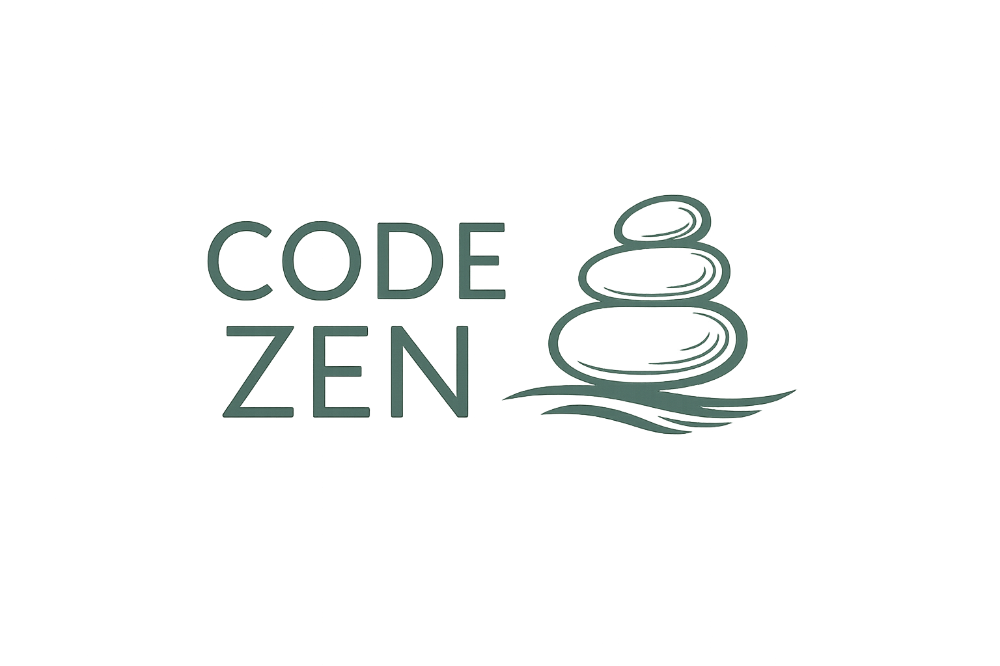

**Code Zen** brings philosophy-driven coding standards to your development workflow:
- **Clarity over cleverness** - Write code that tells a clear story
- **Readability first** - Optimize for human understanding
- **Single responsibility** - Each component has one clear purpose
- **Explicit over implicit** - Make intentions obvious

## Quick Start

### One-Line Installation

Install Code Zen directly from GitHub (recommended):

```bash
sh -c "$(curl -fsSL https://raw.githubusercontent.com/daviguides/code-zen/main/install.sh)"
```

The installer will:
1. Clone the latest version from GitHub
2. Copy `zen-code-standards/` to `~/.claude/zen-code-standards/`
3. Optionally configure `~/.claude/CLAUDE.md`
4. Clean up temporary files automatically

## What is Code Zen?

Code Zen is a collection of **language-agnostic** and **language-specific** coding guidelines designed as a **Claude Code plugin**. It helps you write clear, maintainable code following zen-like principles.

### Universal Principles

The foundation of Code Zen applies to any programming language:

- **Write code in English** - Facilitate international collaboration
- **Prioritize clarity and readability** - Code is read more than written
- **Single Responsibility Principle** - Each function/class does one thing well
- **Avoid magic numbers/strings** - Use named constants
- **Errors should never pass silently** - Make failures obvious

### Language Support

- ✅ **Python** - Complete guidelines including Zen of Python
- 🚧 **Rust** - Coming soon
- 🚧 **Go** - Coming soon

## Documentation

- [**Zen of Python Explained**](/code-zen/zen-of-python.html) - Deep dive into Python's 19 guiding principles
- [**Universal Principles**](/code-zen/universal-principles.html) - Language-agnostic coding guidelines
- [**Python Standards**](/code-zen/python-standards.html) - Python-specific implementation guide
- [**Why Code Zen?**](/code-zen/why-code-zen.html) - Benefits for developers and AI assistants

## Quick Start (Claude Code)

Add this to your project's `CLAUDE.md`:

```markdown
# Project Coding Standards

## Standards Inheritance
- **INHERITS FROM**: @./zen-code-standards/coding-standards.md
- **PRECEDENCE**: Project-specific rules override universal standards
- **FALLBACK**: When no override exists, universal standards apply
```

## Philosophy

Code Zen is built on timeless software engineering principles, adapted for modern development workflows and AI-assisted coding. Whether you're writing Python, Rust, Go, or any other language, these principles help you create code that is:

- **Beautiful** - Well-structured and aesthetically pleasing
- **Explicit** - Clear about intentions and behavior
- **Simple** - Uses the simplest solution that works
- **Flat** - Avoids unnecessary nesting
- **Readable** - Optimized for human understanding

---

**Get Started:** [Install Code Zen](https://github.com/daviguides/code-zen) | [Read the Philosophy](/code-zen/zen-of-python.html)
